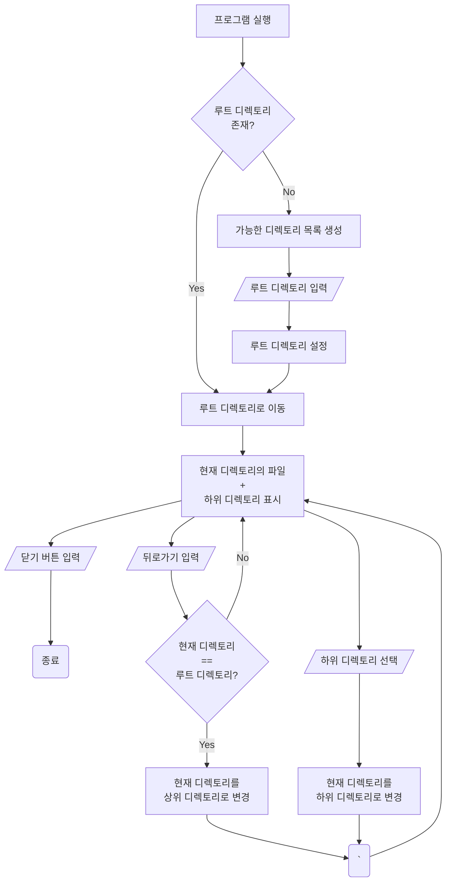

# Electron File Manager

## about this project

This project is making simple file manager using Electron.

# Story Board
## 01 기능 정의

### 01a 주요 기능 정의
- 루트 디렉토리를 사용자가 지정할 수 있음
- 하위 디렉토리, 상위 디렉토리로 이동할수 있음
- 현재 디렉토리의 파일과 하위 디렉토리들을 화면에 보여줌

### 01b 부가 기능 정의 
- 파일 편집
- 폴더 생성
- 폴더 편집
- 파일 드래그 앤 드롭
- 파일 검색
- 파일 세부 정보 확인
- 파일 세부 정보 기반으로 솔팅

### 01c 추가 기능
- VSC 같은 트리 기반의 폴더 계층 구조
- 계층 구조에서 바로 삭제 및 추가 

## 02 사용자 흐름

### 02a 주요 기능

## 03 화면 설계

### 03a 주요 기능

01 시작 화면
  
02a 루트 디렉토리 설정
  
02b 루트 디렉토리 화면
  
03 하위 디렉토리 화면
  

